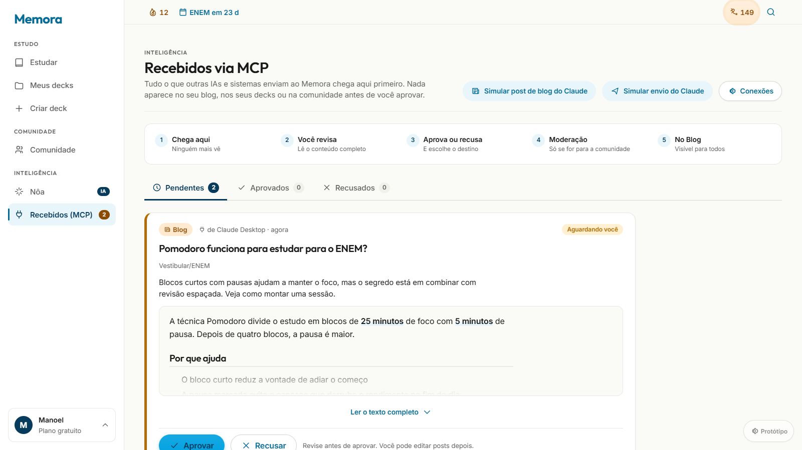
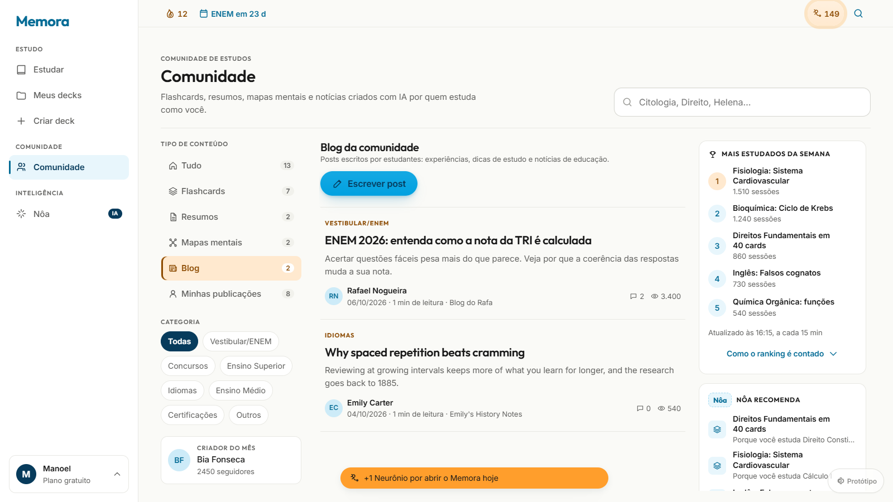
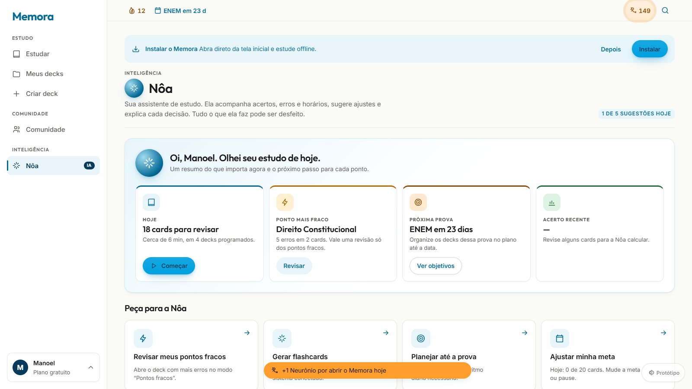
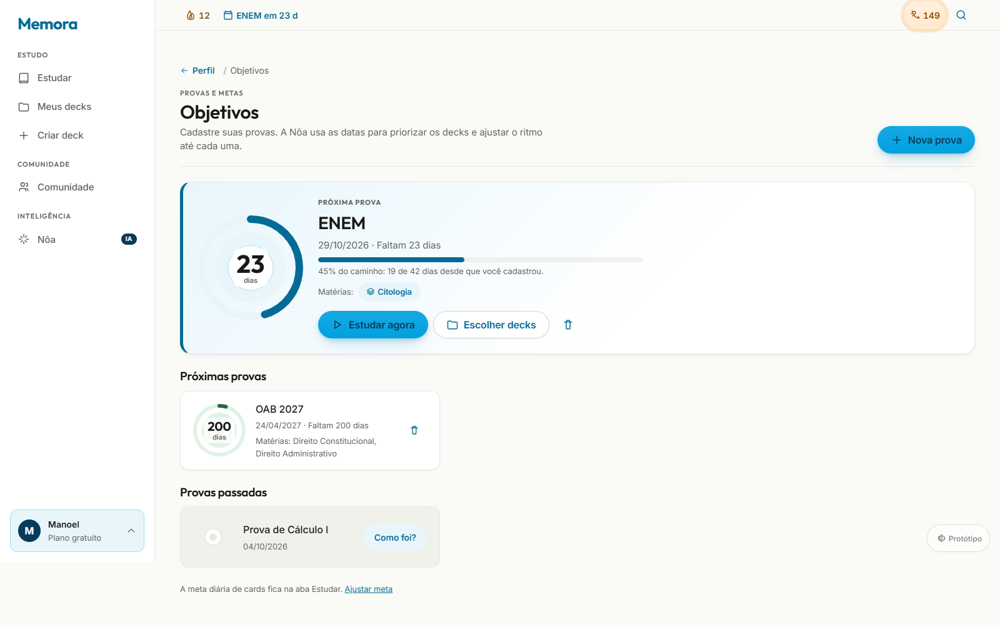
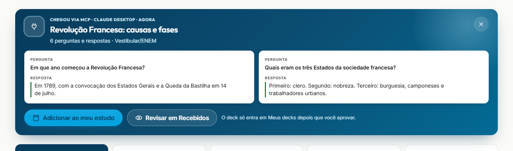

# Memora

[](https://github.com/memora-tech/memora/actions/workflows/ci.yml)

**Comunidade de estudos com IA.** Flashcards com repetição espaçada, resumos, mapas mentais e posts de blog, criados com IA e compartilhados entre estudantes. A **Nôa** é a assistente da casa, e o **servidor MCP** conecta o Memora a outras IAs e plataformas de ensino.

Este repositório é o **mock navegável v1**: app do aluno completo, entrada na conta e quatro painéis web, com uma API mock em Node que reproduz as regras de negócio. Ele foi construído a partir do *Escopo Consolidado v2* e do *Mapa de Telas e Contagem de Toques* (09/09/2026).



## O que tem aqui

| Área | O que faz |
|---|---|
| **Estudar** | Sessão do dia a partir dos decks que o aluno programou, com repetição espaçada (FSRS simplificado), meta diária com alvo visual, sequência e próxima prova |
| **Meus decks** | Biblioteca com pastas. O aluno escolhe quais decks entram no estudo. No deck: perguntas e respostas, três modos de estudo (vencidos, deck inteiro, pontos fracos) e publicação na comunidade |
| **Comunidade** | Linha do tempo de flashcards, resumos, mapas mentais e posts, área de **Blog**, comentários, reações, ranking e **Minhas publicações** |
| **Meu blog** | O aluno escreve posts e compartilha com toda a comunidade (com moderação) ou só com seus seguidores |
| **Nôa** | Leitura do estudo do dia, sugestões, histórico de decisões com "desfazer" e transparência sobre o que ela analisa |
| **Recebidos (MCP)** | Tudo o que outra IA envia chega aqui primeiro. O aluno revisa, aprova (escolhendo o destino) ou recusa |
| **Painéis** | Parental, Escola (B2B), Back-office (moderação, compliance, engenharia) e Parceiro |

<table>
  <tr>
    <td></td>
    <td></td>
  </tr>
  <tr>
    <td></td>
    <td></td>
  </tr>
</table>

## Como rodar

Requisitos: Node 24 e npm 11 (funciona a partir do Node 20.19).

```bash
npm install
npm run dev
```

| Endereço | O que abre |
|---|---|
| http://localhost:5180 | App do aluno (redireciona para entrar) |
| http://localhost:3180/v1/health | API mock |
| http://localhost:5180/parental | Painel Parental |
| http://localhost:5180/b2b | Painel da Escola |
| http://localhost:5180/admin | Back-office |
| http://localhost:5180/parceiro | Painel do Parceiro |

As portas 5180 e 3180 foram escolhidas para não colidir com outros projetos que costumam usar 5173 a 5175 e 3001. Se 5180 estiver ocupada, o Vite usa a próxima livre e avisa no terminal.

Na tela de entrar, **"Entrar direto no app de demonstração"** pula cadastro, confirmações e onboarding, usando a conta de exemplo já verificada. Qualquer credencial preenchida funciona em todas as áreas. O código de confirmação é `123456`.

Os dados ficam em memória: reiniciar a API volta tudo ao estado inicial. Em desenvolvimento, a API observa só `backend/src`, para que sincronizadores de pasta (OneDrive, Dropbox) não a reiniciem ao tocar em `node_modules`.

```bash
npm test                 # backend (regras de negócio e servidor MCP) + frontend (fluxos e painéis)
npm run build            # build de produção com PWA (manifest, service worker, ícones)
npm run preview -w frontend
node frontend/scripts/generate-icons.mjs   # regenera os ícones do PWA
```

## Conectar uma IA por MCP

O Memora expõe um servidor [MCP](https://modelcontextprotocol.io) em `POST /v1/mcp` (Streamable HTTP com respostas JSON). Qualquer cliente compatível pode enviar conteúdo de estudo para a conta do aluno: Claude, ChatGPT, Cursor ou a plataforma de uma escola.

1. No app, abra o card com seu nome (canto inferior esquerdo) › **Conexões** › **Gerar token**. O token aparece uma vez só; o Memora guarda apenas o hash.
2. Adicione o servidor no cliente. No Claude Code:

   ```bash
   claude mcp add --transport http memora http://localhost:5180/v1/mcp --header "Authorization: Bearer mcp_SEU_TOKEN"
   ```

3. Na conversa, peça: *"transforma isso em flashcards e salva no Memora"*.
4. O conteúdo chega em **Recebidos (MCP)**, com um alerta na tela inicial. Lá o aluno revisa e:
   - **aprova**, escolhendo o destino: comunidade (passa pela moderação), só seguidores ou só Meu blog. Decks aprovados entram no estudo;
   - ou **recusa**, e o conteúdo é excluído.

A IA nunca publica sozinha.

| Ferramenta | O que faz |
|---|---|
| `salvar_flashcards` | Envia um deck de perguntas e respostas |
| `salvar_resumo` | Envia um resumo em Markdown com fontes |
| `salvar_mapa_mental` | Envia um mapa mental (árvore de até 5 níveis) |
| `salvar_noticia` | Envia um post de blog, com link e veículo de origem |
| `buscar_comunidade` | Procura conteúdo publicado na comunidade |
| `ler_conteudo` | Traz o conteúdo completo de um item para a conversa |
| `meus_conteudos` | Lista o que o aluno tem no Memora |
| `listar_categorias` | Lista categorias e tipos aceitos |

Sem um cliente MCP à mão, use **"Simular envio do Claude"** ou **"Simular post de blog do Claude"**, que ficam em Recebidos, em Conexões e no botão Protótipo. A simulação chama o mesmo servidor MCP.

## Documentação

- [`docs/ARCHITECTURE.md`](docs/ARCHITECTURE.md): como o sistema se encaixa (backend, frontend, subsistemas centrais), com diagramas.
- [`docs/openapi.yaml`](docs/openapi.yaml): referência de toda rota `/v1` (OpenAPI 3.0), incluindo conteúdos, MCP e Nôa.
- [`docs/adr/`](docs/adr/README.md): decisões de arquitetura e produto, com o porquê de cada uma. O [ADR-0011](docs/adr/0011-servidor-mcp-e-conteudos-gerados-por-ia.md) cobre o MCP e os conteúdos gerados por IA.
- [`CONTRIBUTING.md`](CONTRIBUTING.md): guia de engenharia (setup, convenções, como adicionar rota ou feature, testes).
- [`REVISAO.md`](REVISAO.md): auditoria de conformidade contra o escopo, com achados abertos e fechados.

## Estrutura

```
memora/
  backend/                 API mock Express 5 (estado em memória)
    src/routes/            rotas /v1 por domínio (auth, study, decks, community, materials,
                           mcp, noa, wallet, privacy, parental, b2b, admin, partner, …)
    src/lib/               FSRS, ledger de Neurônios, auditoria com hash encadeado,
                           publicação e moderação, conteúdos (materials), ferramentas MCP
    src/seed/              dados fictícios: decks, comunidade, conteúdos, amostras MCP, painéis
    test/                  testes de regra de negócio e do servidor MCP (supertest)
  frontend/                Vite 8 + React 18 (JavaScript) + PWA
    src/design-system/     componentes base (Screen, Panel, TabBar, TargetRing, QACard, …)
    src/areas/             student (barra lateral, menu da conta), parental, partner, b2b, admin
    src/features/          study, decks, create, community, noa, mcp, profile, wallet, …
    src/i18n/pt-BR/        todas as strings, por domínio
    src/test/              fluxos do aluno contra o backend real em processo
  docs/                    arquitetura, OpenAPI, ADRs e capturas de tela
  .github/workflows/       CI: testes e build a cada push e pull request
```

## Controles do protótipo

O botão **Protótipo**, no canto inferior direito, alterna os estados que mudam a interface:
- perfil do aluno: adulto gratuito, adulto Premium ou menor de 16;
- cupom resgatável e modo offline;
- chegada de notificação push ou WhatsApp, respeitando opt-in, limites, janela de silêncio e deduplicação;
- simulação de cansaço durante a sessão;
- cenário da próxima geração: normal, falha definitiva ou documento grande;
- simulação de envio por MCP (deck ou post de blog);
- reinício dos dados.

## Decisões registradas

- Tema claro travado (Escopo literal: fundo sempre branco perolado #FAFAF7). Cor oficial #00A1E0; botões primários usam texto escuro sobre a cor para atingir contraste AA.
- Desktop em largura total, com barra lateral de 248 px e menu da conta no card do usuário. A partir de 1024 px aparece a barra lateral; abaixo, a barra de abas inferior.
- Tipografia Outfit + Inter e ícones vetoriais monocromáticos. Cada tipo de conteúdo tem cor própria, sempre acompanhada do nome.
- Conteúdo de IA nunca entra na comunidade sem a aprovação do aluno e, quando for para todos, sem a moderação.
- Categorias do sistema são uma lista provisória marcada no seed. Reações fixas: 👏 🔥 🧠 💡 ❤️ 😂.
- Interface em PT-BR com strings externalizadas; EN aparece como indisponível no seletor.
- O PDF de exportação é entregue como texto no protótipo.
