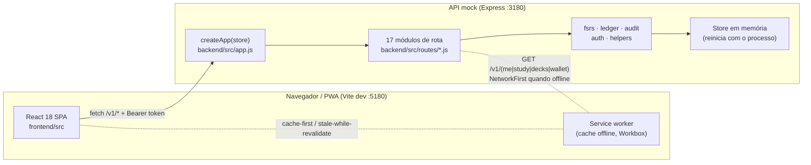
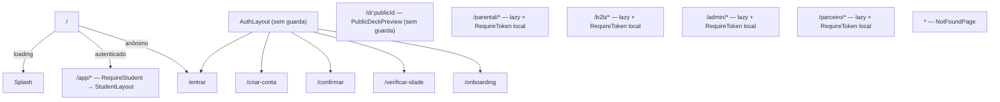
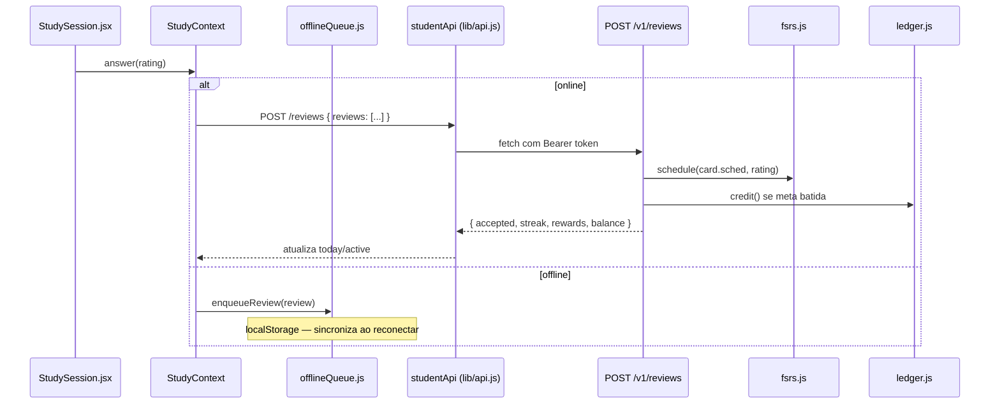

# Arquitetura — Memora (mock navegável v1)

> Este documento descreve a arquitetura do **protótipo mock** do Memora: um app do aluno completo
> (PWA React) mais quatro painéis web, servidos por uma API Express que reproduz as regras de
> negócio do Escopo Consolidado v2 com estado em memória. **Não é a arquitetura de produção** —
> não há banco de dados, fila de mensageria, autenticação real nem infraestrutura de deploy. Onde
> uma decisão de produção ainda está em aberto, isso é dito explicitamente.
>
> Ver também: [Referência de API (OpenAPI)](./openapi.yaml) · [Registro de decisões (ADRs)](./adr/README.md) · [Guia de engenharia](../CONTRIBUTING.md) · [Auditoria de conformidade](../REVISAO.md)

## 1. Visão geral

O frontend é **uma única SPA** que hospeda cinco áreas com propósitos e públicos diferentes,
todas servidas pelo mesmo servidor Vite e pela mesma API:

| Área | Rota | Público | Guarda de rota |
|---|---|---|---|
| App do aluno | `/app/*` | Estudante (menor ou adulto) | `RequireStudent` — reativa, via `SessionContext` |
| Entrada/onboarding | `/entrar`, `/criar-conta`, … | Anônimo | Nenhuma (público) |
| Prévia pública de deck | `/d/:publicId` | Anônimo | Nenhuma |
| Painel Parental | `/parental/*` | Responsável | `RequireToken` local (síncrona, por token em storage) |
| Painel B2B | `/b2b/*` | Escola (admin/coordenador/professor/leitura) | idem |
| Back-office | `/admin/*` | Operação Memora (7 papéis) | idem |
| Painel do Parceiro | `/partner/*` | Estabelecimento parceiro de cupom | idem |

As quatro áreas externas são carregadas com `React.lazy()` — não entram no bundle inicial do app
do aluno. Cada uma faz login em sua própria rota (`POST /v1<área>/auth/login`) e recebe um token
cujo `role` de sessão (`student`, `guardian`, `b2b_<papel>`, `admin_<papel>`, `partner`) restringe
o que pode acessar no backend (`requireRole` em `backend/src/lib/auth.js`). Um único processo
Express serve todas — não há isolamento de rede real entre áreas, apenas checagem de papel por
requisição.

## 2. Backend

### 2.1 Composição da aplicação

`backend/src/server.js` cria o `store` (estado semeado, ver §2.2) e a app (`createApp(store)` em
`backend/src/app.js`), e sobe o Express na porta `3180` (`PORT`). `createApp` monta, nesta ordem:

1. `cors()` e `express.json({ limit: '2mb' })`.
2. Um middleware que injeta `req.store = store` — é assim que toda rota alcança o estado; não há
   camada de repositório/DAO, as rotas leem e escrevem `state` diretamente.
3. Um `express.Router()` em `/v1` que agrega 17 módulos de rota por domínio
   (`backend/src/routes/*.js`), cada um exportando uma função `xxxRoutes()` que retorna um Router.
4. Handler 404 uniforme e um error handler final que traduz `err.status`/`err.code` para a
   resposta JSON `{ code, message }` usada em toda a API (ver `httpError()`/`fail()` em
   `backend/src/lib/helpers.js`).

Quatro módulos de rota (`parentalRoutes`, `b2bRoutes`, `adminRoutes`, `partnerRoutes`) são
montados sob um prefixo próprio (`/v1/parental`, `/v1/b2b`, `/v1/admin`, `/v1/partner`); os demais
ficam direto em `/v1`. Um décimo oitavo módulo, `protoRoutes` (`/v1/_proto/*`), **não exige
autenticação** — existe só para a barra de ferramentas do protótipo trocar perfil, resetar dados e
simular notificações; não tem equivalente em produção.

### 2.2 Estado e persistência

Não há banco de dados (ver [ADR-0001](./adr/0001-backend-mock-em-memoria.md)). `backend/src/store.js`
mantém um único objeto `state`, recriado por `seed(profile)` (`backend/src/seed/index.js`) na
subida do processo e sempre que `POST /_proto/reset` é chamado. `store.reset()` também limpa todos
os `setTimeout` pendentes (`store.timers`) — importante porque o pipeline de geração por IA
(`backend/src/routes/generation.js`) simula latência de fila com `store.later(fn, ms)` em vez de
processar de forma síncrona.

Três usuários fixos existem no seed (`u1` aluno, `g1` responsável, mais os usuários de cada
painel), e a barra de protótipo troca o **perfil** do aluno (`adult-free`, `adult-premium`,
`minor`) sem trocar de conta — é assim que o protótipo demonstra os três perfis sem precisar de
múltiplas contas reais.

### 2.3 Módulos de biblioteca (`backend/src/lib/`)

| Módulo | Responsabilidade |
|---|---|
| `auth.js` | Sessões em memória (`createSession`, `findSession` com expiração deslizante de 30 dias) e o middleware `requireRole(...roles)` — toda rota autenticada usa uma instância dele (`requireStudent`, `requireGuardian`, etc.). |
| `fsrs.js` | Agendador de repetição espaçada (ver §4.1). |
| `ledger.js` | Lançamentos imutáveis da moeda virtual Neurônios (ver §4.2). |
| `audit.js` | Log de auditoria com cadeia de hash (ver §4.3) e `recordAccess()` para o "ver como" do suporte. |
| `helpers.js` | `fail()`/`httpError()` (formato de erro uniforme), `publicUser()` (projeção do usuário para o cliente), `ensureDay()` (vira o "dia" de estudo/cota/orçamento por fuso do usuário), `guardianGate()` (bloqueio por permissão do responsável), `PLAN_LIMITS` (limites free/premium). |
| `ids.js` | Geração de IDs, timestamps, `dayKey()` (data no fuso do usuário), `sha256()`, código de cupom. |

### 2.4 Autenticação e autorização

Sessão simples por token opaco (`tok_<random>`), sem JWT/refresh — ver
[ADR-0008](./adr/0008-autenticacao-por-sessao-simples.md). O cliente manda
`Authorization: Bearer <token>`; `requireRole(...roles)` resolve a sessão, valida o papel e
popula `req.session`/`req.user`. Cada área tem seu próprio espaço de papéis
(`student`, `guardian`, `b2b_admin|coordenador|professor|leitura`,
`admin_moderador|suporte_n1|suporte_n2|comercial|financeiro|compliance|engenharia`, `partner`) —
um token de uma área nunca autoriza rotas de outra.

## 3. Frontend

### 3.1 Roteamento

`frontend/src/app/App.jsx` é a raiz: `BrowserRouter` → `AppProviders` (contexts globais) →
`AppRoutes` + `ProtoBar` (barra de ferramentas do protótipo, sempre montada). Dentro de
`AppRoutes`:

`RequireStudent` (definida em `App.jsx`) é **reativa**: consulta `useSession()`
(`status: loading|anon|authed`), mostra `Splash` durante o carregamento, redireciona para
`/entrar?next=<path>` se anônimo, e mostra `DeactivatedScreen` se a conta pediu exclusão e está em
carência. As quatro áreas externas usam uma guarda **síncrona** e independente
(`RequireToken`/`RequireB2B`/`RequireAdmin` locais a cada área), que só checa se existe token no
`localStorage` — sem estado de loading nem refresh central. São dois padrões de guarda
deliberadamente diferentes porque as áreas externas não compartilham `SessionContext` com o app
do aluno.

### 3.2 Gerência de estado (`frontend/src/state/`)

Três contexts, todos no padrão **Context + `useReducer`/`useState` + hook `useXxx()`** (sem
Redux/Zustand — nenhuma lib de estado global está no `package.json`), falando com a API somente
através de `frontend/src/lib/api.js` (nunca `fetch` direto):

- **`SessionContext`** — identidade do aluno: `user`, `notifications`, `consents`, `subscription`,
  ações de login/registro/confirmação/verificação de idade/onboarding/logout. Cai para um cache em
  `localStorage` (`memora.cache.me`) se `/me` falhar por rede, e limpa tudo em `401`.
- **`StudyContext`** — o mais complexo: sessão do dia (`today`), sessão ativa de flashcards
  (fila, índice, respostas, fadiga), sugestões da Nôa, fila offline de revisões. Trata
  desconexão via `isOffline()`/`onConnectivity()` e `frontend/src/lib/offlineQueue.js`
  (`enqueueReview`/`flushReviews`), sincronizando ao reconectar.
- **`ProtoContext`** — estado das *ferramentas de protótipo* (não é estado de produto real):
  espelha `GET /_proto/state` e aciona os demais endpoints `/_proto/*`; persiste preferências de
  simulação (offline, próxima geração) em `localStorage`.

`frontend/src/lib/api.js` expõe um cliente por escopo (`studentApi`, `parentalApi`, `b2bApi`,
`adminApi`, `partnerApi`, `publicApi`), cada um com seu próprio token em
`localStorage` (`memora.token.<scope>`) — é o que permite, por exemplo, abrir o Painel Parental e
o app do aluno em abas diferentes do mesmo navegador sem um token pisar no outro.

### 3.3 Design system (`frontend/src/design-system/`)

Um único CSS Module (`ds.module.css`, ~1200 linhas) compartilhado por todos os componentes —
não há um módulo por componente. Sem lib de ícones externa: `Icon.jsx` é um dicionário próprio de
`paths` SVG. Componentes: `Button`, `Icon`, `Field`/`Input`/`Textarea`/`Select`,
`Toggle`/`Segmented`/`Chip`/`Badge`/`ProgressBar`/`Stepper`/`Banner`/`Avatar`/`Stat`/`Tabs`
(`Controls.jsx`), `Surface`/`ListItem`/`EmptyState`/`Skeleton`/`SectionTitle`/`Wordmark`
(`Surface.jsx`), `Sheet`/`ConfirmDialog`, `OverflowMenu`, `NeuronCounter`, `PageHeader`,
`Toast`/`ToastProvider`. Uso extensivo de ARIA nativo (`role="switch"`, `role="radiogroup"`,
`role="progressbar"`, `role="alertdialog"`, `role="tablist"`).

### 3.4 Organização por feature

`frontend/src/features/` é **feature-first**: `auth`, `study`, `create`, `decks`, `community`,
`wallet`, `profile`, `proto`, `public`, `notifications` — cada uma com suas páginas/componentes e
(com uma exceção) seu próprio `<feature>.module.css`. `frontend/src/areas/` segue o mesmo padrão
para as áreas roteadas (`student`, `parental`, `b2b`, `admin`, `partner`), cada uma com um
`*Area.jsx` como ponto de entrada.

### 3.5 Internacionalização

Dicionário próprio, sem lib externa (`frontend/src/i18n/index.js`): `createT(locale)` retorna um
`t(key, vars)` com interpolação `{var}` e pluralização simples (`{ one, other }`); `useT()` é o
hook de consumo. `SUPPORTED_LOCALES` já lista `en` marcado `available: false` — o seletor de
idioma existe na interface, mas só `pt-BR` tem conteúdo (ver
[ADR-0006](./adr/0006-pt-br-unico-com-strings-externalizadas.md)). Dicionário organizado por
domínio em `frontend/src/i18n/pt-BR/*.js`, espelhando 1:1 `features/`+`areas/`.

### 3.6 PWA

`vite-plugin-pwa`, `registerType: 'autoUpdate'`, manifest com `start_url: '/app'`,
`display: 'standalone'`, atalhos ("Começar a estudar", "Criar deck", "Carteira"). Workbox:
pré-cache de estáticos, `NetworkFirst` (timeout 3 s) para `/v1/(me|study/today|decks|wallet)` —
as únicas chamadas de API com fallback de cache — e `navigateFallbackDenylist` excluindo `/v1/*`
do fallback de SPA. Em dev, o Vite roda em `:5180` e faz proxy de `/v1` para o backend mock em
`:3180`.

### 3.7 Testes

Duas estratégias distintas, propositalmente diferentes:

- **`frontend/src/test/studentFlows.test.jsx`, `sessionStrict.test.jsx`** — integração de ponta a
  ponta contra um **backend real (mock) em processo**: `frontend/src/test/liveServer.js` importa
  `backend/src/app.js` diretamente, sobe um Express efêmero (`app.listen(0)`) e faz *monkey-patch*
  de `fetch` para redirecionar `/v1/*` a ele. Cobrem fluxos críticos (regra dos 3 toques, sessão em
  `StrictMode`).
- **`frontend/src/areas/*/*.test.jsx`** (um por painel) — integração de UI local com `fetch`
  mockado manualmente (`vi.fn()` + tabela de respostas por rota); não sobem servidor nenhum.
- **`frontend/src/test/gestures.test.jsx`** — unitário dos hooks de gesto (`useSwipe`,
  `useLongPress`).
- **`backend/test/api.test.js`** — testes de regra de negócio via `supertest` direto sobre
  `createApp(store)`, sem HTTP real.

## 4. Subsistemas centrais

### 4.1 Agendador de repetição espaçada (FSRS simplificado)

`backend/src/lib/fsrs.js` implementa uma versão simplificada do algoritmo FSRS: cada card guarda
`{ stability, difficulty, due, reps, lapses, consecutiveLapses }`; `schedule(current, rating)`
recalcula esses valores a partir de uma nota (`again|hard|good|easy`) e um vetor fixo de 21
parâmetros (`DEFAULT_PARAMS`), mirando 90% de retenção (`TARGET_RETENTION`). `isDue()` decide se
um card entra na fila do dia. Ver [ADR-0003](./adr/0003-fsrs-simplificado.md).

### 4.2 Ledger imutável (Neurônios)

A moeda virtual do produto (Neurônios) nunca é armazenada como um saldo mutável: `ledger.js`
mantém uma lista **append-only** de lançamentos (`{ amount, type, meta, balanceAfter }`);
`balanceOf()` lê o `balanceAfter` do último lançamento do usuário, e `appendEntry()` rejeita
qualquer débito que deixaria o saldo negativo (`insufficient_balance`, HTTP 422). Isso dá
rastreabilidade total de onde cada Neurônio veio ou foi gasto, sem precisar de uma tabela de
saldo separada para manter consistente. Ver [ADR-0004](./adr/0004-ledger-imutavel-de-neuronios.md).

### 4.3 Auditoria com cadeia de hash

`audit.js` encadeia cada entrada de auditoria ao hash SHA-256 da anterior
(`prevHash` → `hash`), ao estilo de um log *tamper-evident*: `verifyChain()` percorre o log e
detona no primeiro elo quebrado. O back-office de Compliance expõe esse resultado
(`GET /admin/compliance/overview` → `chain: { ok, brokenAt? }`). Ver
[ADR-0005](./adr/0005-auditoria-com-cadeia-de-hash.md).

### 4.4 Liberação do responsável (guardian gate)

Ações sensíveis de uma conta de menor (publicar na comunidade, compartilhar link público,
adicionar membro externo a uma pasta, seguir um criador) passam por `guardianGate()`
(`backend/src/lib/helpers.js`): se a permissão não estiver liberada, a rota devolve
`403 guardian_required` **e already** cria (ou reaproveita) uma solicitação pendente
(`addParentalRequest`) que aparece no Painel Parental para aprovação — o aluno nunca fica só com
um erro sem próximo passo.

### 4.5 Orçamento de notificação (janela de silêncio + deduplicação)

`POST /_proto/notification` (simulação) e o painel de Engenharia
(`notificationTemplates`/`notificationOptOutLimit`) reproduzem três regras de produto: contas de
menor ficam travadas em intensidade "leve"; nenhuma notificação sai fora da janela de silêncio do
usuário (padrão 22h–8h, menor 21h–7h); e o mesmo tema não repete no mesmo canal em menos de 2 h
(deduplicação por `channel:tema`).

### 4.6 Idempotência

Duas rotas aceitam uma chave de idempotência do cliente para tolerar reenvio (rede instável,
double-tap): `POST /generation/jobs` (header `Idempotency-Key`, válida 24 h) e
`POST /coupons/:id/redeem` (`idempotencyKey` no corpo) — ambas devolvem o resultado já produzido
em vez de duplicar o efeito (gerar de novo, debitar de novo).

## 5. Fluxo de dados — exemplo (revisão de estudo)

## 6. Limitações conhecidas (não é produção)

- **Sem persistência real**: todo o estado vive em memória e é perdido a cada reinício do
  processo Node (mitigado pelo `/_proto/reset` e pelo cache client-side em `localStorage`).
- **Sem fila real**: o pipeline de geração por IA simula latência com `setTimeout`
  (`store.later()`), não com uma fila de mensageria.
- **Autenticação simplificada**: sessão por token opaco sem rotação/refresh, aceitável para um
  protótipo de demonstração, não para produção (ver ADR-0008).
- **Sem comentários inline no código** — decisão deliberada de estilo do protótipo, ver
  [ADR-0007](./adr/0007-sem-comentarios-de-codigo.md); este documento e as ADRs existem
  justamente para registrar fora do código o que os comentários registrariam.
- Uma lista mais granular de lacunas funcionais conhecidas (moderação, ranking por reputação,
  aviso de renovação, etc.) está em [`REVISAO.md`](../REVISAO.md).
